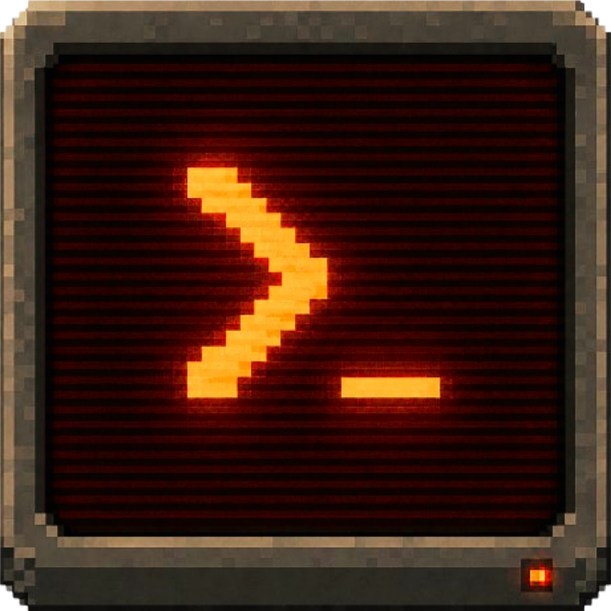

<div align="center">
  
  <h1>executr</h1>
</div>

Containerized **autonomous plan execution** for one or more target repositories, deployable on Coolify.

It wraps [umputun/ralphex](https://github.com/umputun/ralphex) (the "extended Ralph loop") and drives the legacy watch loop through [umputun/fya](https://github.com/umputun/fya) so unattended runs stay on the **Claude Max plan** instead of the Agent-SDK credit pool. The control-plane can claim plans for Codex execution; its default provider is `codex` with model `gpt-5.5` and reasoning effort `xhigh`.

> Status: deployment scaffold. The image + Coolify wiring below are the focus; a couple of items are flagged **VERIFY** and the voice "ask-human" escalation is not built yet.

## What's in the container

| Tool | Role |
|---|---|
| Claude Code + **fya** | legacy watch-loop task execution on the Max plan (fya = PTY wrapper for headless interactive Claude) |
| ralphex | the loop for unclaimed/default repo plans: tasks → validation → review → finalize/PR |
| **agent-browser** (+ Chrome) | per-task browser verification against the app's dev server |
| codex | control-plane executor for claimed plans (`gpt-5.5`, reasoning `xhigh` by default) |
| pnpm, gh, git, ripgrep | toolchain |

## How it runs

A long-running worker container:

1. Clones bootstrap repos from `REPOS` (optional seed) into a persistent volume on first boot, `pnpm install`s each.
2. Starts the **control-plane** on `:8090` — seeds the repo registry from `REPOS`, then writes `/workspace/.executr/repos.list` (the loop-readable source of truth for which repos to watch).
3. Serves the ralphex **dashboard** on `:8080` (Coolify maps a domain).
4. Every poll it reads `repos.list`, **fetches + `git pull --ff-only`** each repo's base branch, and **watches each repo's `docs/plans/*.md`**. Unclaimed plans execute once per file content through the legacy Claude/fya path. Plans claimed by the control-plane for Codex are skipped by this loop and handled by the control-plane path.

**Repos are managed from the control-plane UI** (`:8090`) — add or archive repos live, with no env edit or container restart needed. `REPOS` is now an optional bootstrap seed: use it to pre-register repos on first boot, or leave it unset and add repos via the UI.

`REPOS` entries (when used) are `name=URL[#branch]` or just `URL`, e.g.
`REPOS="app=https://github.com/your-org/your-repo.git#main,api=https://github.com/your-org/api.git"`.
Each repo is cloned to `/workspace/<name>/` and runs independently. **The image is generic** — per-repo behavior (dev-server URL, the agent-browser check, whether to open a PR) lives in **each repo's own `.ralphex/` config**, so commit an `.ralphex/` into every target repo.

A plan is plain markdown:

```markdown
# Plan: My Feature
## Validation Commands
- `pnpm test`
### Task 1: Do the thing
- [ ] implement X
- [ ] add tests
```

Files without a `### Task N:` or `### Iteration N:` section are treated as non-executable notes and **skipped** (otherwise ralphex fails them on every poll). Each plan runs **once per content** — its outcome is recorded under the repo's `.ralphex/plan-state/`, so it is **not re-picked-up** on the next poll. To re-run a completed or failed plan, edit the file so its content hash changes.

## Step 1 — Mint headless auth tokens (on your Mac)

There's no macOS keychain on the server, so auth is **token-based**:

```bash
# Claude (Max plan, headless): mint a portable OAuth token
claude setup-token            # -> CLAUDE_CODE_OAUTH_TOKEN   (VERIFY this keeps you on Max, not SDK credits)

# GitHub: a token with 'repo' + 'workflow' scope -> GITHUB_TOKEN

# Codex control-plane execution: either set OPENAI_API_KEY, or copy/mount ~/.codex/auth.json
# into the container. The legacy ralphex loop leaves EXTERNAL_REVIEW=none.
```

## Step 2 — Deploy on Coolify

1. **Create the resource.** Two methods; **B is recommended** — Coolify has open bugs where the compose *build context* arrives empty even for git-based deploys ([coolify#6002](https://github.com/coollabsio/coolify/issues/6002), [#5182](https://github.com/coollabsio/coolify/issues/5182)), so letting Coolify build is flaky. The prebuilt image avoids building in Coolify entirely.
   - **B — Prebuilt image (recommended):** the [`build-image`](./.github/workflows/build.yml) Action pushes `ghcr.io/luiskisters/executr:latest` on every push to `main`. Make that package pullable by Coolify — set it **public** (GitHub → your profile → Packages → executr → Package settings), or add a `read:packages` token as a registry credential in Coolify. Then deploy `docker-compose.yml` (it already references the image) via **Docker Compose** *or* **Empty Docker Compose** — no build context needed.
   - **A — Let Coolify build (fallback):** New Resource → **Docker Compose** → **Private Repository** `luisKisters/executr`, branch `main`, compose `docker-compose.yml`, and replace the `image:` line with `build: .`. May hit the build-context bug above.
   - Never use *Empty Docker Compose* with `build: .` — no Dockerfile in context, so it fails with `open Dockerfile: no such file or directory` (the original error).
2. **Environment Variables** — set these (secrets where sensitive); see [`.env.example`](./.env.example):
   - `CLAUDE_CODE_OAUTH_TOKEN`, `GITHUB_TOKEN` (required)
   - `REPOS` — optional bootstrap seed, comma-separated `name=URL[#branch]` (repos are managed via the control-plane UI after first boot; falls back to `REPO_URL`/`REPO_BRANCH` if unset)
   - `OPENAI_API_KEY` or a mounted `~/.codex/auth.json` for control-plane Codex execution
   - `GIT_AUTHOR_NAME` / `GIT_AUTHOR_EMAIL`
   - optional: `GROQ_API_KEY`, `TELEGRAM_BOT_TOKEN`, `RALPHEX_WEB_HOST` (dashboard bind address; defaults to `0.0.0.0` so Coolify's proxy can reach it)
3. **Storage** — the named volume `executr_repo` persists the clone, `docs/plans/`, and `.ralphex/` state across redeploys.
4. **Domain** — point one at port `8080` for the dashboard.
5. **Deploy.** First boot is slow (clone + `pnpm install` + Chrome already baked in).

## Step 3 — Run work

Drop a markdown plan into `/workspace/<name>/docs/plans/` (per repo in `REPOS`) — via Coolify's container terminal, a committed file in the target repo, or the mounted volume. The loop picks it up; watch the dashboard; the PR lands on GitHub.

## How your MCPs / skills / envs carry over

- **MCPs** — the target repo's `.mcp.json` rides along in the clone; Claude-via-fya auto-loads it. MCP servers needing keys → add those as Coolify env vars.
- **Skills** — commit Claude skills into the repo, or bake them into the image (`COPY` into `$CLAUDE_CONFIG_DIR`). agent-browser skills ship with the CLI.
- **Envs** — the app's `.env.local` rides in the clone (or inject values as Coolify secrets, which is cleaner than committing).

## Gotchas (VERIFY on first deploy)

1. **Claude token billing** — `claude setup-token` is subscription-billed (Max) per [Anthropic's docs](https://code.claude.com/docs/en/authentication); still worth a trivial smoke-test on first deploy.
2. **Release assets / build** — the Dockerfile resolves the latest `fya`/`ralphex` versions at build time and builds green in CI; runs non-root as `node` (Claude refuses `--dangerously-skip-permissions` as root).
3. **Per-repo `.ralphex/`** — each target repo needs its own `.ralphex/` (config + prompts) committed, or it runs with ralphex defaults (no browser gate, no auto-PR).
4. **Codex headless** — `OPENAI_API_KEY` bills per use; for ChatGPT-plan Codex, mount `~/.codex/auth.json` for the `node` user. `EXTERNAL_REVIEW` stays `none` for the legacy ralphex loop.
5. **Dashboard idle** — verify `ralphex --serve --watch` runs without prompting on your ralphex version.
6. **Voice ask-human** — not wired yet; `TELEGRAM_BOT_TOKEN` here only powers ralphex's built-in notifications for now.

## Local test

```bash
cp .env.example .env   # fill in tokens
docker compose up --build
# dashboard: http://localhost:8080
```

## Background

This is the deployment layer of the "executr" idea — adopting ralphex + fya rather than building an orchestrator from scratch (XML/markdown plans, per-phase browser gate, Telegram voice escalation).
